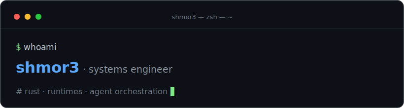

  

 

I build the substrate other software runs on — runtimes, schedulers, and the
protocols that let independent pieces cooperate without knowing about each other.

Lately that means turning AI agents from demos into systems. Not another wrapper
around a model, but the layer underneath: a runtime with its own small language,
a scheduler that decides what runs where, and a plugin model where tools and
models attach over open protocols like MCP and ACP. The hard part was never the
model — it's orchestration, isolation, and failure: making a dozen moving parts
behave like one program you can actually reason about.

I'm a platform person more than an app person. I care about the layer that has to
be correct so everything above it is free to be careless. I'd rather understand
one system completely than wire five together and hope.

 

**Mostly Rust** — reached for when correctness and control matter more than
moving fast. Go, TypeScript, and Python when the job asks for them.

Cambridge, MA · <a href="https://rstanford.com">rstanford.com</a>
