<!-- the banner is two hand-written SVGs (light/dark). no widgets, nothing phones home. -->
<picture>
  <source media="(prefers-color-scheme: dark)" srcset="assets/banner-dark.svg">
  <source media="(prefers-color-scheme: light)" srcset="assets/banner-light.svg">
  
</picture>

Whole ecosystems, mostly in Rust: an agent-orchestration platform, the fleet
of services around it, the SDKs and CLIs, and the inference engines underneath.

Lead engineer on <a href="https://simse.dev">simse</a>. Runtimes, build systems,
and the occasional shipped product on the side.

The parts I care about are the ones you only notice when they're missing —
isolation, clean scheduling, failure you can reason about.

Cambridge, MA · <a href="https://rstanford.com">rstanford.com</a>
